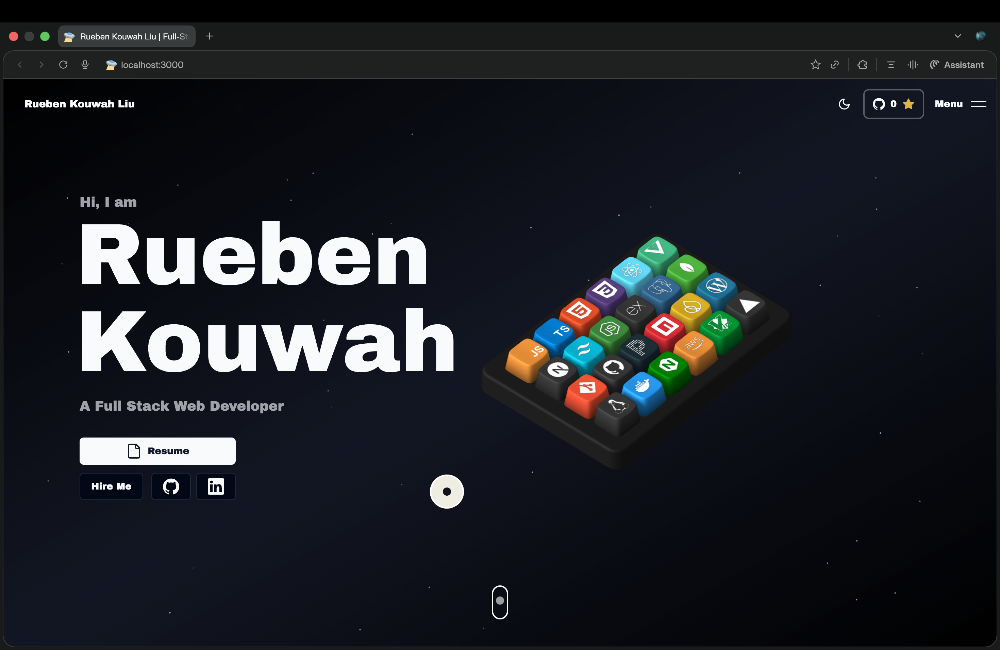

# 🚀 Rueben Kouwah Liu — 3D Developer Portfolio



An immersive 3D developer portfolio showcasing my work in **Full-Stack Development, Data Analytics, and AI-powered applications**.

Built with modern web technologies, interactive 3D experiences, and performance-focused architecture to create a memorable and professional web presence.

---

## 👨‍💻 About Me

Hi, I’m **Rueben Kouwah Liu**  
B.Tech Computer Science (Amity University) — CGPA: 7.18

I specialize in:

- Full-Stack Web Development
- Data Analytics & Machine Learning
- AI-powered automation systems
- Interactive UI/UX engineering

📍 Noida, Uttar Pradesh, India  
📧 rueliu1@gmail.com  
🔗 GitHub: https://github.com/codeRueben  
🔗 LinkedIn: (Add your LinkedIn profile link)

---

## ✨ Portfolio Features

- 🎮 Interactive 3D Skill Keyboard (Spline powered)
- 🌌 Space-themed animated background
- ⚡ GSAP + Framer Motion smooth animations
- 🌗 Light / Dark Mode toggle
- 📊 Dynamic project showcase
- 📩 Integrated contact form
- 📱 Fully responsive design
- 🚀 Production-ready deployment on Vercel

---

## 🛠 Tech Stack

### Frontend
- Next.js 14
- React 18
- TypeScript
- Tailwind CSS
- Shadcn UI

### Backend
- Node.js
- REST APIs
- Prisma ORM
- MySQL
- Firebase

### Data & Analytics
- Python
- Pandas
- NumPy
- scikit-learn
- SQL
- Excel
- Recharts

### 3D & Animation
- Spline Runtime
- GSAP
- Framer Motion

---

## 📌 Featured Projects

### 💰 AI Finance Tracker  
AI-powered SMS transaction parser that automates financial tracking and eliminates manual entry.

**Key Highlights:**
- Secure authentication & protected API routes
- AI-based SMS parsing
- Dynamic financial dashboards
- Optimized relational database schema

🔗 Live Demo:  
https://ai-finance-tracker-9nukdfgov-ruebens-projects-0b064456.vercel.app/

---

### 📊 Customer Churn Analysis  
Machine Learning churn prediction system using the IBM Telco dataset.

**Key Highlights:**
- Analysed 7,043 telecom records
- Compared Logistic Regression, Random Forest, Decision Tree & Gradient Boosting
- Best AUC-ROC Score: 0.87
- Identified high-risk churn segments

🔗 GitHub Repository:  
https://github.com/codeRueben/telco-churn-analysis

---

### 🗺 Land Boundary Mapping App  
GPS-based Flutter app for land boundary verification and area calculation using Mapbox SDK.

🔗 GitHub Repository:  
https://github.com/codeRueben/Land-boundary-app

---

## 🏢 Professional Experience

### Data Analyst Intern  
Directorate of Economics and Statistics, Government of Nagaland  
(May 2025 – June 2025)

- Automated data cleaning using Python (Pandas, NumPy)
- Built SQL dashboards and Excel automation
- Reduced manual reporting workload by 40%
- Developed district-level visualization dashboards for regional planning

---

## 🎓 Education

**Amity University, Noida**  
B.Tech in Computer Science (2022 – 2026)

---

## 🚀 Getting Started

### Prerequisites
- Node.js (v18+)
- pnpm (recommended) / npm / yarn

### Installation

1. Clone the repository:
```bash
git clone https://github.com/codeRueben/3d-portfolio
```
2.	Install dependencies:

```bash
pnpm install
```
3.	Run development server:
```bash
pnpm dev
```
4.	Open:
```bash
http://localhost:3000
```
🌍 Deployment

This portfolio is deployed on Vercel.

You can deploy your own version instantly:
📄 License

This portfolio is customized and maintained by Rueben Kouwah Liu.

Inspired by an open-source 3D portfolio template and fully rebranded with original projects and professional experience.

⸻

🤝 Let’s Connect

If you’re interested in collaboration, internships, or full-time opportunities:

📧 rueliu1@gmail.com
🔗 https://github.com/codeRueben


